# Application Architecture


## Table of Contents

- [Overview](#overview)
  - [High-Level Architecture](#high-level-architecture)
- [Project Statistics](#project-statistics)
- [Project Structure](#project-structure)
- [Architecture Principles](#architecture-principles)
  - [Layer Separation](#layer-separation)
- [Testing Strategy](#testing-strategy)
  - [Unit Tests](#unit-tests)
  - [E2E Tests](#e2e-tests)
- [Benefits](#benefits)
- [Dependency Analysis](#dependency-analysis)
  - [Dependency Graph](#dependency-graph)
  - [Analysis Commands](#analysis-commands)
  - [Automatic Validation](#automatic-validation)
- [Future Extensions](#future-extensions)

---

## Overview

This project follows a **layered architecture** with strict separation between framework-agnostic business logic and Angular-specific presentation code. The architecture ensures portability, testability, and maintainability.

### High-Level Architecture

```mermaid
flowchart TB
    subgraph Presentation["🔵 Presentation Layer"]
        Shell["Shell<br/>(Routes, Config)"]
        Pages["Feature Pages<br/>(Components)"]
    end

    subgraph DI["🔵 DI Layer"]
        subgraph FeatureDI["Feature DI"]
            FDI1["feature-a"]
            FDI2["feature-b"]
        end
        subgraph LibDI["Lib DI"]
            LDI1["context-x"]
            LDI2["context-y"]
        end
    end

    subgraph Config["🟠 Configuration Layer"]
        UserConfig["User Config<br/>(Runtime Settings)"]
    end

    subgraph Features["🟥 Features (Vertical Slices)"]
        subgraph Feature1["feature-a"]
            F1Domain["🟠 Domain"]
            F1App["🟢 Application"]
            F1Infra["🟣 Infrastructure"]
            F1Pres["🔵 Presentation"]
        end
        subgraph Feature2["feature-b"]
            F2Domain["🟠 Domain"]
            F2App["🟢 Application"]
            F2Infra["🟣 Infrastructure"]
            F2Pres["🔵 Presentation"]
        end
        subgraph Feature3["feature-c"]
            F3Domain["🟠 Domain"]
            F3Infra["🟣 Infrastructure"]
            F3Pres["🔵 Presentation"]
        end
    end

    subgraph Lib["🟩 Lib (Horizontal Slices)"]
        subgraph Context1["http-client"]
            C1Domain["🟠 Domain"]
            C1App["🟢 Application"]
            C1Infra["🟣 Infrastructure"]
        end
        subgraph Context2["asset-loader"]
            C2Domain["🟠 Domain"]
            C2Infra["🟣 Infrastructure"]
        end
        subgraph Context3["date-time"]
            C3Domain["🟠 Domain"]
            C3Infra["🟣 Infrastructure"]
        end
        subgraph Context4["performance"]
            C4Domain["🟠 Domain"]
            C4Infra["🟣 Infrastructure"]
        end
    end

    %% Presentation Layer
    Shell --> Pages
    Pages --> F1Pres
    Pages --> F2Pres
    Pages --> F3Pres

    %% Feature-a internal
    F1Pres --> FDI1
    F1Pres --> F1App
    F1App --> F1Domain
    F1Infra --> F1Domain
    FDI1 --> C1Infra

    %% Feature-b internal
    F2Pres --> FDI2
    F2Pres --> F2App
    F2App --> F2Domain
    F2Infra --> F2Domain
    FDI2 --> C2Infra

    %% Feature-c internal
    F3Pres --> F3Infra
    F3Infra --> F3Domain

    %% Features using other Features
    F2Infra --> F1Domain
    F3Infra --> F1Domain

    %% Features using Libs
    F1Infra --> C1Domain
    F1Infra --> C2Domain
    F2Infra --> C1Domain
    F3Infra --> C3Domain

    %% Lib DI
    LDI1 --> C1Infra
    LDI1 --> UserConfig
    LDI2 --> C2Infra
    LDI2 --> UserConfig

    %% Libs using other Libs
    C1App --> C1Domain
    C1Infra --> C1Domain
    C1Infra --> C2Domain
    C1Infra --> C3Domain
    C1Infra --> C4Domain

    C2Infra --> C2Domain
    C2Infra --> C1Domain

    C3Infra --> C3Domain

    C4Infra --> C4Domain

    %% Container Styles
    style Presentation fill:#e3f2fd,stroke:#03A9F4,stroke-width:2px,color:#000000
    style DI fill:#e3f2fd,stroke:#03A9F4,stroke-width:2px,color:#000000
    style FeatureDI fill:#f5f5f5,stroke:#03A9F4,stroke-width:1px,color:#000000
    style LibDI fill:#f5f5f5,stroke:#03A9F4,stroke-width:1px,color:#000000
    style Config fill:#fff3e0,stroke:#FF9800,stroke-width:2px,color:#000000
    style Features fill:#FCE4EC,stroke:#C2185B,stroke-width:2px,color:#000000
    style Lib fill:#E0F2F1,stroke:#00897B,stroke-width:2px,color:#000000

    style Feature1 fill:#f9f9f9,stroke:#C2185B,stroke-width:1px,color:#000000
    style Feature2 fill:#f9f9f9,stroke:#C2185B,stroke-width:1px,color:#000000
    style Feature3 fill:#f9f9f9,stroke:#C2185B,stroke-width:1px,color:#000000
    style Context1 fill:#f9f9f9,stroke:#00897B,stroke-width:1px,color:#000000
    style Context2 fill:#f9f9f9,stroke:#00897B,stroke-width:1px,color:#000000
    style Context3 fill:#f9f9f9,stroke:#00897B,stroke-width:1px,color:#000000
    style Context4 fill:#f9f9f9,stroke:#00897B,stroke-width:1px,color:#000000

    %% Node Styles
    style Shell fill:#81D4FA,color:#000000,stroke:#03A9F4,stroke-width:1px
    style Pages fill:#81D4FA,color:#000000,stroke:#03A9F4,stroke-width:1px
    style FDI1 fill:#81D4FA,color:#000000,stroke:#03A9F4,stroke-width:1px
    style FDI2 fill:#81D4FA,color:#000000,stroke:#03A9F4,stroke-width:1px
    style LDI1 fill:#81D4FA,color:#000000,stroke:#03A9F4,stroke-width:1px
    style LDI2 fill:#81D4FA,color:#000000,stroke:#03A9F4,stroke-width:1px
    style UserConfig fill:#FFB74D,color:#000000,stroke:#FF9800,stroke-width:1px

    style F1Domain fill:#FFCC80,color:#000000,stroke:#FF9800,stroke-width:1px
    style F1App fill:#81C784,color:#000000,stroke:#388E3C,stroke-width:1px
    style F1Infra fill:#B39DDB,color:#000000,stroke:#673AB7,stroke-width:1px
    style F1Pres fill:#81D4FA,color:#000000,stroke:#03A9F4,stroke-width:1px

    style F2Domain fill:#FFCC80,color:#000000,stroke:#FF9800,stroke-width:1px
    style F2App fill:#81C784,color:#000000,stroke:#388E3C,stroke-width:1px
    style F2Infra fill:#B39DDB,color:#000000,stroke:#673AB7,stroke-width:1px
    style F2Pres fill:#81D4FA,color:#000000,stroke:#03A9F4,stroke-width:1px

    style F3Domain fill:#FFCC80,color:#000000,stroke:#FF9800,stroke-width:1px
    style F3Infra fill:#B39DDB,color:#000000,stroke:#673AB7,stroke-width:1px
    style F3Pres fill:#81D4FA,color:#000000,stroke:#03A9F4,stroke-width:1px

    style C1Domain fill:#FFCC80,color:#000000,stroke:#FF9800,stroke-width:1px
    style C1App fill:#81C784,color:#000000,stroke:#388E3C,stroke-width:1px
    style C1Infra fill:#B39DDB,color:#000000,stroke:#673AB7,stroke-width:1px
    style C2Domain fill:#FFCC80,color:#000000,stroke:#FF9800,stroke-width:1px
    style C2Infra fill:#B39DDB,color:#000000,stroke:#673AB7,stroke-width:1px
    style C3Domain fill:#FFCC80,color:#000000,stroke:#FF9800,stroke-width:1px
    style C3Infra fill:#B39DDB,color:#000000,stroke:#673AB7,stroke-width:1px
    style C4Domain fill:#FFCC80,color:#000000,stroke:#FF9800,stroke-width:1px
    style C4Infra fill:#B39DDB,color:#000000,stroke:#673AB7,stroke-width:1px

    linkStyle default stroke:#000000,stroke-width:1px
```



**Architectural Pattern:**
- 🔵 **Presentation** = Angular components & UI (framework-coupled)
- 🔵 **DI** = Angular dependency injection configuration (framework-coupled)
- 🟠 **Domain** = Business logic & contracts (framework-agnostic)
- 🟢 **Application** = Use cases & orchestration (framework-agnostic)
- 🟣 **Infrastructure** = Technical implementations (framework-agnostic)
- 🟥 **Features** = Business domain modules (vertical slices)
- 🟩 **Lib** = Shared bounded contexts (horizontal slices)
- 🟠 **Config** = Application configuration (framework-agnostic with minimal DI integration)

**Dependency Rules:**
- ✅ **Features → Features**: Allowed (via domain interfaces)
- ✅ **Features → Libs**: Allowed (reuse shared contexts)
- ✅ **Libs → Libs**: Allowed (compose contexts)
- ❌ **Libs → Features**: Forbidden (libs must remain reusable)
- ✅ **Presentation** depends on Application, Domain, and DI
- ✅ **Application** depends on Domain only
- ✅ **Infrastructure** implements Domain interfaces
- ✅ **DI** bridges framework-agnostic code to Angular DI system
- ✅ All framework-agnostic layers testable without Angular

---

## Project Statistics

- **Total TypeScript Files**: 84
- **Production Files**: 61
- **Test Files**: 23
- **Framework-Agnostic Files**: 53 (87%)
- **Angular-Specific Files**: 8 (13%)
- **Circular Dependencies**: 0 ✅

*Last generated: 2026-01-11*

---

## Project Structure

```
src/app/
├── lib/                         # Shared/reusable code (DDD bounded contexts)
│   ├── asset-loader/           # 🟢 Asset loading bounded context
│   │   ├── domain/             # Interfaces & contracts
│   │   │   └── asset-loader.interface.ts
│   │   └── infrastructure/     # Asset loading implementations
│   │       └── http-asset-loader.ts
│   │
│   ├── date-time/              # 🟢 Date-time bounded context
│   │   ├── domain/             # Interfaces & contracts
│   │   │   └── current-date-time-provider.interface.ts
│   │   └── infrastructure/     # Platform API adapters
│   │       └── date-time-provider.ts
│   │
│   ├── performance/            # 🟢 Performance monitoring context
│   │   ├── domain/             # Interfaces & contracts
│   │   │   └── high-resolution-timestamp-provider.interface.ts
│   │   └── infrastructure/     # Platform API adapters
│   │       └── performance-timestamp-provider.ts
│   │
│   └── http-client/            # 🔵 HTTP communication context
│       ├── domain/             # Business contracts & value objects
│       │   ├── http-client.interface.ts
│       │   ├── http-request.interface.ts
│       │   ├── http-response.interface.ts
│       │   ├── http-url.ts
│       │   ├── method/         # HTTP methods
│       │   └── status/         # HTTP status codes
│       │
│       ├── application/        # Use cases & orchestration
│       │   └── interceptors/   # Request/response interceptors
│       │       ├── logger/     # Request/response logging
│       │       ├── response-time/ # Response time tracking
│       │       ├── sequence-number/ # Request sequencing
│       │       └── timestamp/  # Request timestamping
│       │
│       └── infrastructure/     # Technical implementations
│           ├── fetch-http-client.ts  # Fetch API adapter
│           ├── body-parsers/         # Response body parsers
│           │   ├── json/             # JSON parser
│           │   └── text/             # Text parser
│           ├── request-executor/     # Request execution
│           │   └── fetch/            # Fetch implementation
│           └── errors/               # HTTP error types
│               ├── abort/            # Abort errors
│               ├── network/          # Network errors
│               └── payload/          # Payload errors
│
├── di/                          # 🔵 Dependency injection layer
│   ├── http-client/            # HTTP client DI configuration
│   │   ├── inject-functions/   # Injectable functions
│   │   │   ├── assets-http-client.inject.ts
│   │   │   └── vault-http-client.inject.ts
│   │   ├── injection-tokens/   # DI tokens
│   │   │   ├── assets-http-client.token.ts
│   │   │   └── vault-http-client.token.ts
│   │   └── providers/          # Provider configurations
│   │       ├── assets-http-client.provider.ts
│   │       └── vault-http-client.provider.ts
│   │
│   └── user-config/            # User configuration DI
│       ├── inject-functions/   # Injectable functions
│       │   └── user-config.inject.ts
│       ├── injection-tokens/   # DI tokens
│       │   └── user-config.token.ts
│       └── providers/          # Provider configurations
│           └── user-config.provider.ts
│
└── shell/                       # 🔵 Application shell (Angular-specific)
    ├── app.component.ts
    ├── app.component.html
    ├── app.component.scss
    ├── app.config.client.ts     # Client-side app configuration
    ├── app.config.server.ts     # Server-side app configuration
    ├── app.config.shared.ts     # Shared app configuration
    ├── app.routes.ts            # Client routes
    ├── app.routes.server.ts     # Server routes
    └── pages/
        └── dashboard-page/      # Route components

src/config/
└── user/                        # 🟠 User configuration management
    ├── user-config.interface.ts
    ├── user-config-loader.ts
    └── user-config-validator.ts

src/testing/
└── unit/                        # 🔵 Angular-specific test utilities
```

---

## Architecture Principles

### Layer Separation

🟠 **Domain Layer** (`domain/`):
- Pure TypeScript interfaces and value objects
- Business contracts and domain models
- No external dependencies
- Framework-agnostic
- Defines what the system does

🟢 **Application Layer** (`application/`):
- Pure TypeScript use cases and orchestration
- Coordinates domain objects
- No framework dependencies
- Implements business workflows (e.g., interceptors)
- Testable without Angular TestBed

🟣 **Infrastructure Layer** (`infrastructure/`):
- Pure TypeScript implementations
- Platform API adapters (fetch, Date, performance)
- No `@angular/*` imports
- Constructor-based dependency injection
- Testable without Angular TestBed

🟠 **Configuration Layer** (`config/user`):
- User configuration management
- Runtime config loading and validation
- Type-safe configuration interfaces
- Framework-agnostic business logic with minimal DI integration

🔵 **Dependency Injection Layer** (`di/`):
- Dependency injection configuration and wiring
- Bridge between framework-agnostic code and Angular DI
- Organized by context (http-client, user-config, etc.)
- Three-tier structure:
  - `injection-tokens/` - DI tokens for type-safe injection
  - `providers/` - Provider configurations
  - `inject-functions/` - Convenience functions using Angular `inject()`
- Uses `@angular/*` imports

🔵 **Presentation Layer** (`shell/`, `presentation/`):
- Angular components with decorators
- Router and Material UI components
- Angular Testing Library
- `@angular/*` imports allowed

## Testing Strategy

### Unit Tests
- **Infrastructure**: Pure TypeScript tests (no Angular TestBed)
- **Components**: Vitest browser mode with Testing Library

### E2E Tests
- Framework-agnostic page objects
- Reusable across different test runners

---

## Benefits

1. **Framework Independence**: Core business logic portable to any platform
2. **Testability**: Test infrastructure code without Angular
3. **Clear Separation**: Framework-agnostic vs Angular-specific code
4. **Maintainability**: Focused responsibilities per layer
5. **Future-Proof**: Framework migration only affects presentation layer
6. **Type Safety**: Full TypeScript strict mode coverage

---

## Dependency Analysis

### Dependency Graph

**Architecture Overview** (always readable):

See the [High-Level Architecture](#high-level-architecture) diagram above for the conceptual structure.

**Detailed Module Graph**:

<details>
<summary>🔄 Module Dependencies Overview (click to expand)</summary>

<a href="module-dependencies.svg" target="_blank">
  
</a>

*Click image to open full size*

</details>

<details>
<summary>📐 Architectural Layers Visualization (click to expand)</summary>

<a href="architecture-layers.svg" target="_blank">
  
</a>

*Click image to open full size*

**Legend**:
- 🔵 **Blue** = Presentation Layer
- 🔵 **Cyan Tint** = Providers Layer
- 🟢 **Green** = Application Layer
- 🟣 **Purple** = Infrastructure Layer
- 🟠 **Orange** = Domain Layer
- 🟩 **Teal** = Lib Container (shared foundation)
- 🟥 **Rose** = Features Container (business modules)

</details>

> 💡 **Tips**:
> - Click the graph image to view full size
> - Right-click → "Open image in new tab" for maximum zoom
> - SVG files support native browser zoom (Ctrl/Cmd + scroll or pinch)
> - In VS Code: Right-click SVG → "Open Preview" for pan/zoom

Key metrics:
- ✅ No circular dependencies
- Clear separation between layers
- Minimal coupling between modules

### Analysis Commands

```bash
# Check for circular dependencies
npm run analyze:deps

# Generate visual dependency graphs
npm run analyze:modules            # Module dependencies overview
npm run analyze:layers             # Architectural layers visualization

# Find orphaned/unused files
npm run analyze:orphans
```

### Automatic Validation

A Git pre-push hook automatically:
- ✅ Checks for circular dependencies (fails push if found)
- ✅ Checks for orphaned files (fails push if found)
- ✅ Updates dependency graph and commits it
- ✅ Ensures code quality before sharing

This prevents architectural issues from being pushed to the repository.

---

## Architecture Decision Records (ADRs)

Key architectural decisions are documented in individual files for better organization and readability.

📋 **[View Architecture Decision Records →](adr/README.md)**

This includes decisions about:
- Layered architecture and framework separation
- Technology choices (Vitest, Playwright, Angular Material)
- Development practices and automation
- Future considerations for complex features

---

## Future Extensions

When adding new features:

```
src/app/
├── features/                    # Business domain features
│   └── {feature-name}/
│       ├── domain/             # 🟠 Pure TypeScript business logic
│       ├── application/        # 🟢 Pure TypeScript use cases & orchestration
│       ├── infrastructure/     # 🟣 Pure TypeScript implementations
│       └── presentation/       # 🔵 Angular components
│
├── lib/
│   ├── {context-name}/         # Shared bounded context
│   │   ├── domain/             # 🟠 Shared domain models
│   │   ├── application/        # 🟢 Shared use cases (e.g., interceptors)
│   │   └── infrastructure/     # 🟣 Shared implementations
│   └── presentation/           # 🔵 Shared Angular components (future)
│
└── di/
    └── {context-name}/         # 🔵 DI configuration for context
        ├── inject-functions/   # Convenience functions using inject()
        ├── injection-tokens/   # DI tokens
        └── providers/          # Provider configurations
```

---

**Last Updated**: January 11, 2026
