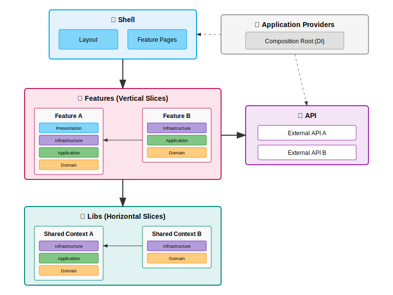

# Application Architecture


## Table of Contents

- [Overview](#overview)
  - [High-Level Architecture](#high-level-architecture)
- [Project Statistics](#project-statistics)
- [Project Structure](#project-structure)
- [Architecture Principles](#architecture-principles)
  - [Layer Separation](#layer-separation)
- [Testing Strategy](#testing-strategy)
  - [Unit Tests](#unit-tests)
  - [E2E Tests](#e2e-tests)
- [Benefits](#benefits)
- [Dependency Analysis](#dependency-analysis)
  - [Dependency Graph](#dependency-graph)
  - [Analysis Commands](#analysis-commands)
  - [Automatic Validation](#automatic-validation)
- [Future Extensions](#future-extensions)

---

## Overview

This project follows a **layered architecture** with strict separation between framework-agnostic business logic and Angular-specific presentation code. The architecture ensures portability, testability, and maintainability.

### High-Level Architecture



**Architectural Pattern:**
- ⬜ **Application Providers** = Angular dependency injection configuration for features and libs (framework-coupled, composition root)
- 🟦 **Shell** = Application shell (Layout) & Feature Pages (framework-coupled)
- 🟪 **API** = External APIs integration (framework-agnostic)
- 🟥 **Features** = Business domain modules (vertical slices)
- 🟩 **Lib** = Shared bounded contexts (horizontal slices)
- 🔵 **Presentation** = Angular components & UI (framework-coupled)
- 🟣 **Infrastructure** = Technical implementations (framework-agnostic)
- 🟢 **Application** = Use cases & orchestration (framework-agnostic)
- 🟠 **Domain** = Business logic & contracts (framework-agnostic)

**Dependency Rules:**
- ✅ **Features → Features**: Allowed (via domain interfaces)
- ✅ **Features → Libs**: Allowed (reuse shared contexts)
- ✅ **Libs → Libs**: Allowed (compose contexts)
- ❌ **Libs → Features**: Forbidden (libs must remain reusable)
- ✅ **Presentation** depends on Infrastructure, Application and Domain
- ✅ **Infrastructure** depends on Infrastructure and implements Domain interfaces
- ✅ **Application** depends on Domain only
- ✅ All framework-agnostic layers testable without Angular

---

## Project Statistics

- **Total TypeScript Files**: 99
- **Production Files**: 62
- **Test Files**: 37
- **Framework-Agnostic Files**: 47 (76%)
- **Angular-Specific Files**: 15 (24%)
- **Circular Dependencies**: 0 ✅

*Last generated: 2026-01-21*

---

## Project Structure

<details>
<summary>📂 Project Structure (click to expand)</summary>

```
src/app/
├── api/                        # 🟣 External APIs integration
│   ├── assets/                 # Assets API integration
│   │   └── infrastructure/     # API implementation
│   │       ├── assets-api-client.factory.ts
│   │       ├── assets-api-client.ts
│   │       └── index.ts
│   └── vault/                  # Vault API integration
│       └── infrastructure/     # API implementation
│           ├── index.ts
│           ├── vault-api-client.factory.ts
│           └── vault-api-client.ts
│
├── config/                     # Configuration
│   └── app/                    # App configuration context
│       ├── infrastructure/     # Infrastructure implementations
│       │   ├── app-config.dto.ts
│       │   ├── app-config.provider.ts
│       │   └── index.ts
│       └── domain/             # Interfaces & contracts
│           ├── app-config.ts
│           └── index.ts
│
├── lib/                        # Shared/reusable code (DDD bounded contexts)
│   ├── date-time/              # 🟢 Date-time bounded context
│   │   ├── infrastructure/     # Platform API adapters
│   │   │   ├── index.ts
│   │   │   └── system-date-time.ts
│   │   └── domain/             # Interfaces & contracts
│   │       ├── date-time-provider.interface.ts
│   │       ├── date-time.ts
│   │       └── index.ts
│   │
│   ├── http-client/            # 🔵 HTTP communication context
│   │   ├── infrastructure/     # Technical implementations
│   │   │   ├── body-parsers/
│   │   │   │   ├── json/
│   │   │   │   │   └── json.response-body-parser.ts
│   │   │   │   ├── text/
│   │   │   │   │   └── text-plain.response-body-parser.ts
│   │   │   │   └── response-body-parser.interface.ts
│   │   │   ├── errors/
│   │   │   │   ├── abort/
│   │   │   │   │   └── http-abort-error.ts
│   │   │   │   ├── network/
│   │   │   │   │   └── http-network-error.ts
│   │   │   │   └── payload/
│   │   │   │   │   └── http-payload-error.ts
│   │   │   ├── request-executor/
│   │   │   │   ├── fetch/
│   │   │   │   │   └── fetch.http-request-executor.ts
│   │   │   │   └── http-request-executor.interface.ts
│   │   │   ├── fetch-http-client.ts
│   │   │   └── index.ts
│   │   ├── application/        # Use cases & orchestration
│   │   │   ├── interceptors/
│   │   │   │   ├── logger/
│   │   │   │   │   ├── request-logger.http-interceptor.ts
│   │   │   │   │   └── response-logger.http-interceptor.ts
│   │   │   │   ├── response-time/
│   │   │   │   │   ├── response-time.constants.ts
│   │   │   │   │   └── response-time.http-interceptor.ts
│   │   │   │   ├── sequence-number/
│   │   │   │   │   └── sequence-number.http-interceptor.ts
│   │   │   │   ├── timestamp/
│   │   │   │   │   └── timestamp.http-interceptor.ts
│   │   │   │   ├── http-interceptor-next.type.ts
│   │   │   │   └── http-interceptor.interface.ts
│   │   │   └── index.ts
│   │   └── domain/             # Business contracts & value objects
│   │   │   ├── method/
│   │   │   │   └── http-method.ts
│   │   │   ├── status/
│   │   │   │   └── http-status.ts
│   │   │   ├── http-client.interface.ts
│   │   │   ├── http-request.interface.ts
│   │   │   ├── http-response.interface.ts
│   │   │   ├── http-url.ts
│   │   │   └── index.ts
│   │
│   └── performance/            # 🟢 Performance monitoring context
│       ├── infrastructure/     # Platform API adapters
│       │   ├── index.ts
│       │   └── performance-timestamp.ts
│       └── domain/             # Interfaces & contracts
│           ├── high-resolution-timestamp-provider.interface.ts
│           ├── high-resolution-timestamp.ts
│           └── index.ts
│
└── shell/                      # 🔵 Application shell (Angular-specific)
    ├── pages/
    │   └── dashboard-page/     # Route components
    │       ├── dashboard-page.component.html
    │       ├── dashboard-page.component.scss
    │       └── dashboard-page.component.ts
    ├── app.component.html
    ├── app.component.scss
    ├── app.component.ts
    └── index.ts

src/app-providers/              # ⚪ Application-level providers (composition root)
├── app-config/                 # Application configuration providers
│   └── app-config.provider.ts
├── assets-api-client/          # Assets API client providers
│   └── assets-api-client.provider.ts
├── vault-api-client/           # Vault API client providers
│   └── vault-api-client.provider.ts
└── index.ts                    # Exported provider functions

src/testing/
└── unit/                       # Test utilities
    ├── http/
    │   ├── fetch/
    │   │   └── response-builder.ts
    │   └── index.ts
    ├── index.ts
    └── setup-component.ts
```

</details>

---

## Architecture Principles

### Layer Separation

🔵 **Presentation Layer** (`shell/`, `presentation/`):
- Angular components with decorators
- Router and Material UI components
- Angular Testing Library
- `@angular/*` imports allowed

🟣 **Infrastructure Layer** (`infrastructure/`):
- Pure TypeScript implementations
- Platform API adapters (fetch, Date, performance)
- No `@angular/*` imports
- Constructor-based dependency injection
- Testable without Angular TestBed

🟢 **Application Layer** (`application/`):
- Pure TypeScript use cases and orchestration
- Coordinates domain objects
- No framework dependencies
- Implements business workflows (e.g., interceptors)
- Testable without Angular TestBed

🟠 **Domain Layer** (`domain/`):
- Pure TypeScript interfaces and value objects
- Business contracts and domain models
- No external dependencies
- Framework-agnostic
- Defines what the system does

## Testing Strategy

### Unit Tests
- **Infrastructure**: Pure TypeScript tests (no Angular TestBed)
- **Components**: Vitest browser mode with Testing Library

### E2E Tests
- Framework-agnostic page objects
- Reusable across different test runners

---

## Benefits

1. **Framework Independence**: Core business logic portable to any platform
2. **Testability**: Test infrastructure code without Angular
3. **Clear Separation**: Framework-agnostic vs Angular-specific code
4. **Maintainability**: Focused responsibilities per layer
5. **Future-Proof**: Framework migration only affects presentation layer
6. **Type Safety**: Full TypeScript strict mode coverage

---

## Dependency Analysis

### Dependency Graph

**Architecture Overview** (always readable):

See the [High-Level Architecture](#high-level-architecture) diagram above for the conceptual structure.

**Detailed Module Graph**:

<details>
<summary>🔄 Module Dependencies Overview (click to expand)</summary>

<a href="module-dependencies.svg" target="_blank">
  
</a>

*Click image to open full size*

</details>

<details>
<summary>📐 Architectural Layers Visualization (click to expand)</summary>

<a href="architecture-layers.svg" target="_blank">
  
</a>

*Click image to open full size*

**Legend**:
- 🔵 **Blue** = Presentation Layer
- 🟣 **Purple** = Infrastructure Layer
- 🟢 **Green** = Application Layer
- 🟠 **Orange** = Domain Layer
- 🟩 **Teal** = Lib Container (shared foundation)
- 🟥 **Rose** = Features Container (business modules)

</details>

> 💡 **Tips**:
> - Click the graph image to view full size
> - Right-click → "Open image in new tab" for maximum zoom
> - SVG files support native browser zoom (Ctrl/Cmd + scroll or pinch)
> - In VS Code: Right-click SVG → "Open Preview" for pan/zoom

Key metrics:
- ✅ No circular dependencies
- Clear separation between layers
- Minimal coupling between modules

### Analysis Commands

```bash
# Check for circular dependencies
npm run analyze:deps

# Generate visual dependency graphs
npm run analyze:modules            # Module dependencies overview
npm run analyze:layers             # Architectural layers visualization

# Find orphaned/unused files
npm run analyze:orphans
```

### Automatic Validation

A Git pre-push hook automatically:
- ✅ Syncs Sonar project version and architecture metrics
- ✅ Checks for circular dependencies (fails push if found)
- ✅ Checks for orphaned files (fails push if found)
- ✅ Updates dependency graphs
- ✅ Ensures code quality before sharing

This prevents architectural issues from being pushed to the repository.

---

## Architecture Decision Records (ADRs)

Key architectural decisions are documented in individual files for better organization and readability.

📋 **[View Architecture Decision Records →](adr/README.md)**

This includes decisions about:
- Layered architecture and framework separation
- Technology choices (Vitest, Playwright, Angular Material)
- Development practices and automation
- Future considerations for complex features

---

## Future Extensions

When adding new features:

```
src/app/
├── features/                   # Business domain features
│   └── {feature-name}/
│       ├── presentation/       # 🔵 Angular components
│       ├── infrastructure/     # 🟣 Pure TypeScript implementations
│       ├── application/        # 🟢 Pure TypeScript use cases & orchestration
│       └── domain/             # 🟠 Pure TypeScript business logic
│
└── lib/
    └── {context-name}/         # Shared bounded context
        ├── presentation/       # 🔵 Shared Angular components (future)
        ├── infrastructure/     # 🟣 Shared implementations
        ├── application/        # 🟢 Shared use cases (e.g., interceptors)
        └── domain/             # 🟠 Shared domain models

src/app-providers/              # ⚪ Application-level providers
├── {feature-name}/             # Provider configuration for features
│   └── {feature-name}.provider.ts  # Provider function
└── {context-name}/             # Provider configuration for lib contexts
    └── {context-name}.provider.ts  # Provider function
```

---

**Last Updated**: January 21, 2026
