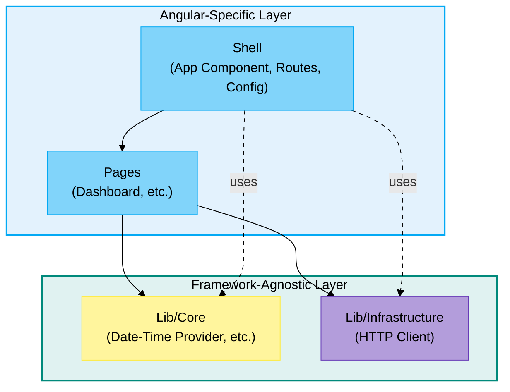
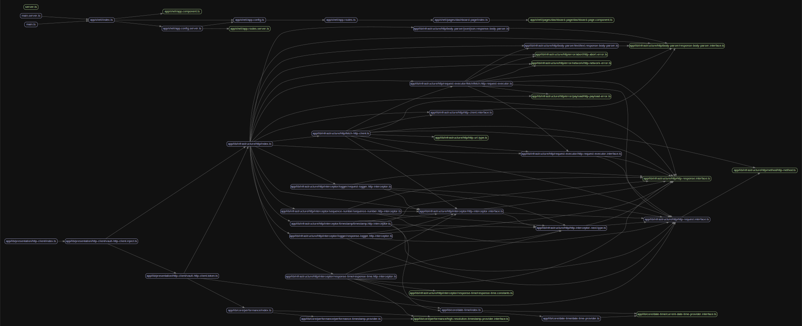
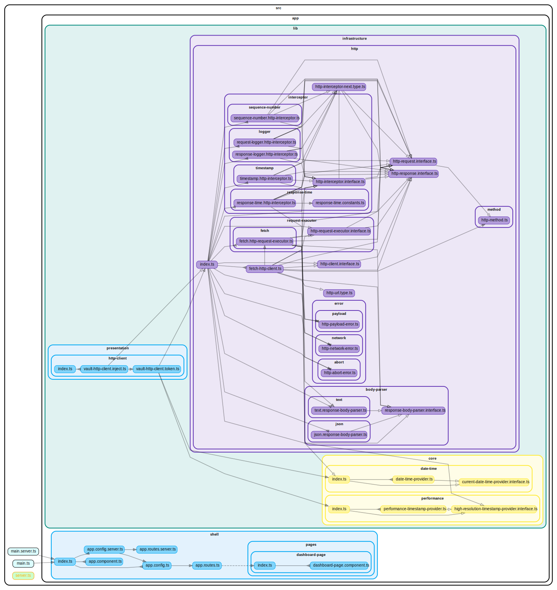

# Application Architecture


## Table of Contents

- [Overview](#overview)
  - [High-Level Architecture](#high-level-architecture)
- [Project Statistics](#project-statistics)
- [Project Structure](#project-structure)
- [Architecture Principles](#architecture-principles)
  - [Layer Separation](#layer-separation)
- [Testing Strategy](#testing-strategy)
  - [Unit Tests](#unit-tests)
  - [E2E Tests](#e2e-tests)
- [Benefits](#benefits)
- [Dependency Analysis](#dependency-analysis)
  - [Dependency Graph](#dependency-graph)
  - [Analysis Commands](#analysis-commands)
  - [Automatic Validation](#automatic-validation)
- [Future Extensions](#future-extensions)

---

## Overview

This project follows a **layered architecture** with strict separation between framework-agnostic business logic and Angular-specific presentation code. The architecture ensures portability, testability, and maintainability.

### High-Level Architecture



**Key Points:**
- 🔵 Blue = Angular-specific presentation layer
- 🟣 Purple = Framework-agnostic layers (core, domain, infrastructure)
- Arrows show dependency flow

---

## Project Statistics

- **Total TypeScript Files**: 64
- **Production Files**: 47
- **Test Files**: 17
- **Framework-Agnostic Files**: 39 (83%)
- **Angular-Specific Files**: 8 (17%)
- **Circular Dependencies**: 0 ✅

*Last generated: 2026-01-01*

---

## Project Structure

```
src/app/
├── lib/                         # Shared/reusable code across features
│   ├── core/                    # 🟣 Pure TypeScript (framework-agnostic)
│   │   └── date-time/          # Date-time provider abstraction
│   └── infrastructure/          # 🟣 Pure TypeScript (framework-agnostic)
│       └── http/                # HTTP client implementation
│           ├── error/           # HTTP error types
│           ├── executor/        # Request execution logic
│           ├── interceptor/     # HTTP interceptors
│           └── method/          # HTTP method types
│
└── shell/                       # 🔵 Application shell (Angular-specific)
    ├── app.component.ts
    ├── app.config.ts
    ├── app.routes.ts
    └── pages/
        └── dashboard-page/      # Route components

src/testing/
├── unit/                        # 🔵 Angular-specific test utilities
└── e2e/                         # 🟣 Framework-agnostic E2E utilities
```

---

## Architecture Principles

### Layer Separation

🟣 **Framework-Agnostic Layers** (`core`, `domain`, `infrastructure`):
- Pure TypeScript interfaces and classes
- No `@angular/*` imports
- No decorators
- Constructor-based dependency injection
- Testable without Angular TestBed

🔵 **Angular-Specific Layers** (`shell`, `presentation`):
- Angular components with decorators
- Router and Material UI components
- Angular Testing Library
- `@angular/*` imports allowed

## Testing Strategy

### Unit Tests
- **Infrastructure**: Pure TypeScript tests (no Angular TestBed)
- **Components**: Vitest browser mode with Testing Library

### E2E Tests
- Framework-agnostic page objects
- Reusable across different test runners

---

## Benefits

1. **Framework Independence**: Core business logic portable to any platform
2. **Testability**: Test infrastructure code without Angular
3. **Clear Separation**: Framework-agnostic vs Angular-specific code
4. **Maintainability**: Focused responsibilities per layer
5. **Future-Proof**: Framework migration only affects presentation layer
6. **Type Safety**: Full TypeScript strict mode coverage

---

## Dependency Analysis

### Dependency Graph

**Architecture Overview** (always readable):

See the [High-Level Architecture](#high-level-architecture) diagram above for the conceptual structure.

**Detailed Module Graph**:

<details>
<summary>🔄 Module Dependencies Overview (click to expand)</summary>

<a href="module-dependencies.svg" target="_blank">
  
</a>

*Click image to open full size*

</details>

<details>
<summary>📐 Architectural Layers Visualization (click to expand)</summary>

<a href="architecture-layers.svg" target="_blank">
  
</a>

*Click image to open full size*

**Legend**:
- 🔵 **Blue** = Presentation Layer
- 🟣 **Purple** = Infrastructure Layer
- 🟠 **Orange** = Domain Layer
- 🟡 **Yellow** = Core Layer
- 🟩 **Teal** = Lib Container (shared foundation)
- 🟥 **Rose** = Features Container (business modules)

</details>

> 💡 **Tips**:
> - Click the graph image to view full size
> - Right-click → "Open image in new tab" for maximum zoom
> - SVG files support native browser zoom (Ctrl/Cmd + scroll or pinch)
> - In VS Code: Right-click SVG → "Open Preview" for pan/zoom

Key metrics:
- ✅ No circular dependencies
- Clear separation between layers
- Minimal coupling between modules

### Analysis Commands

```bash
# Check for circular dependencies
npm run analyze:deps

# Generate visual dependency graphs
npm run analyze:modules            # Module dependencies overview
npm run analyze:layers             # Architectural layers visualization

# Find orphaned/unused files
npm run analyze:orphans
```

### Automatic Validation

A Git pre-push hook automatically:
- ✅ Checks for circular dependencies (fails push if found)
- ✅ Checks for orphaned files (fails push if found)
- ✅ Updates dependency graph and commits it
- ✅ Ensures code quality before sharing

This prevents architectural issues from being pushed to the repository.

---

## Architecture Decision Records (ADRs)

Key architectural decisions are documented in a separate file for better organization and readability.

📋 **[View Architecture Decision Records →](ADR.md)**

This includes decisions about:
- Layered architecture and framework separation
- Technology choices (Vitest, Playwright, Angular Material)
- Development practices and automation
- Future considerations for complex features

---

## Future Extensions

When adding new features:

```
src/app/
├── features/                    # Business domain features
│   └── {feature-name}/
│       ├── core/               # 🟣 Pure TypeScript core utilities
│       ├── domain/             # 🟣 Pure TypeScript business logic
│       ├── infrastructure/     # 🟣 Pure TypeScript implementations
│       └── presentation/       # 🔵 Angular components
│
├── lib/
│   ├── core/                   # 🟣 Shared core utilities (current)
│   ├── domain/                 # 🟣 Shared domain models (future)
│   ├── infrastructure/         # 🟣 Shared implementations (current)
│   └── presentation/           # 🔵 Shared Angular components (future)
```

---

**Last Updated**: December 31, 2025
